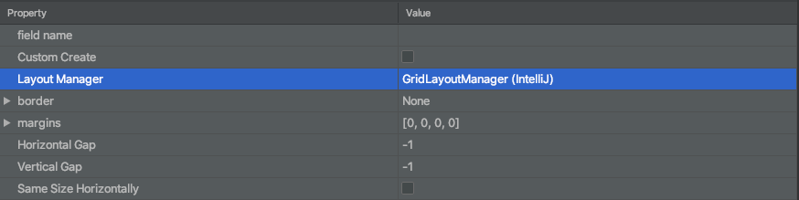

# ⭐ Swing ile GUI Programlama

## 🐞 Hata Notları

### ➕ IntelliJ üzerinde `Panel`'e `Component` Eklerken `NullPointerException` Hatası

* 🕵️‍♂️ Hatanın kaynaklanma sebebi IntelliJ IDE'nin kendisine ait olan `GridLayoutManager(IntelliJ)` isimli `LayoutManager` objesidir
* 👨‍🔧 IDE form yönetimi yapılan GUI Designer üzerinden `JPanel`'i seçip, `LayoutMananger` değerini değiştirin \(resimdeki gibi\)
* 💁‍♂️ Veya kod ile `contentPane.setLayout(new CardLayout());` değiştirebilirsiniz

> 📢 İşlemleri yaptıktan sonra paneli`panel.revalidate();` kodu ile güncellemeyi unutmayın


‍🧙‍♂ Detaylı bilgi için [IntelliJ gui creator: JPanel gives runtime null pointer exception upon adding any component](https://stackoverflow.com/a/59565611/9770490) alanına bakabilirsin.


